# Modbus协议  
## 简介  
**什么是modbus协议？**  
modbus协议是工业领域通信协议的业界标准，并且是当前工业电子设备之间常用的连接方式之一。Modbus协议是一种单主/多从的通信协议，其特点是在同一时间，总线上只能有一个主设备，但可以有一个或者多个（最多247个）从设备。Modbus通信总是由主设备发起，当从设备没有收到来自主设备的请求时，不会主动发送数据。从设备之间不能相互通信，主设备同时只能启动一个Modbus访问事务处理。  
***
**请求：** 主设备发送的请求报文主要包括从设备地址（或者广播地址0）、功能码、传输的数据以及差错检测字段。  
**应答：** 从设备的应答报文包括地址、功能码、差错检测域等。  
**两种发送请求报文方式：** 单播模式、广播模式。  
**两种传输帧模式：** ASCII模式和RTU模式。注：两种方式不可共存。
***
* modbus通信模式可分为RTU模式、ASCII模式和TCP/IP模式。他们的数据模型和功能调用上都是相同的，只有传输报文封装方式是不同的。  
* RTU模式和TCP/IP模式非常相似，唯一的差别是RTU最后带两个字节的CRC校验，而TCP/IP没有  
* RTU模式和ASCII模式的区别就是把RTU的每一个字节(例如：27H)高四位(2)和低四位(7)拆分为两个字节，并以ASCII码的方式表现出来(32 37),再给命令帧分别加上起始符和结束符就可以了，但是他们的校验方式是不同的
* 通常情况下，modbus协议是一个主/从（master/slave）或者客户端/服务器（Client/Server）架构的协议。  
***  
modbus事务处理过程：  
主机设备（或客户端）创建Modbus应用数据单元形成查询报文，其中功能码标识了像从机设备（或服务器端）指示将执行哪种操作。功能码占用一个字节，有效的码字范围是十进制1~255（其中128~255为异常响应保留）。查询报文创建完毕，主机设备（或客户端）向从机设备（或服务器）发送报文，从机设备（或服务器）接收报文后，根据功能码做出相应的动作，并将响应报文返回给主机设备（或客户端）。如下图所示  
  
***
## Modbus寄存器
寄存器的意义如下图所示：  
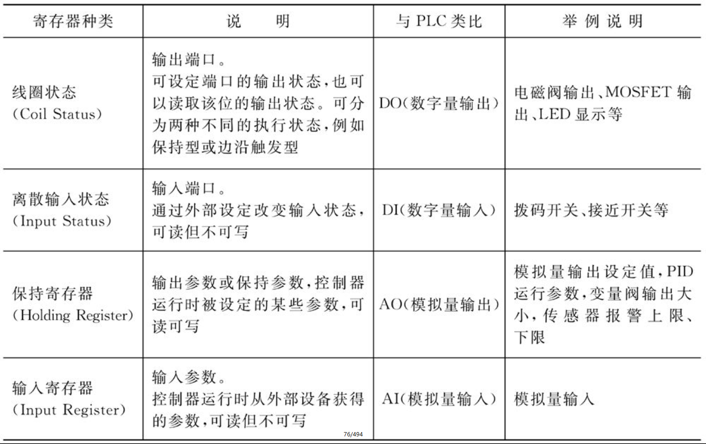  
寄存器地址分配：  
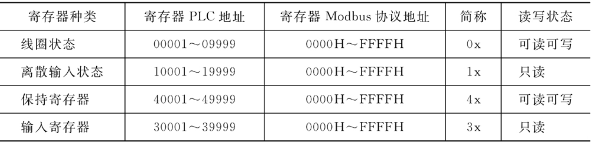  
寄存器Modbus协议地址指的是通信时使用的寄存器寻址地址，例如PLC地址40001对应寻址地址0x0000,40002对应寻址地址0x0001。 
## Modbus串行消息帧格式   
**Modbus ASCII消息帧格式**  
当控制器设为在Modbus网络上以ASCII模式通信时，在消息中每个8位（bit）的字节都将作为两个ASCII字符发送。  
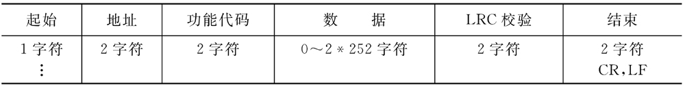  
在ASCII模式下，消息以冒号（:）字符（ASCII码0x3A）开始，以回车换行符结束(ASCII码0x0D,0x0A)。消息帧的其他字段（域）可以使用的传输字符是十六进制的0…9,A…F。处于网络上的Modbus设备不断侦测“:”字符，当有一个冒号接收到时，每个设备进入解码阶段，并解码下一个字段（地址域）来判断是否是发给自己的。消息帧中的字符间发送的时间间隔最长不能超过1秒，否则接收的设备将认为发生传输错误。  
**Modbus RTU消息帧格式**  
在RTU模式中，消息的发送和接收以至少3.5个字符时间的停顿间隔为标志。另外，在一帧报文中，必须以连续的字符流发送整个报文帧。如果两个字符之间的空闲间隔大于1.5个字符时间，那么认为报文帧不完整，该报文将被丢弃。  
3.5字符间隔概念：3.5时间间隔目的是作为区别前后两帧数据的分隔符。3.5时间间隔只对RTU模式有效。    
Modbus RTU相邻帧间隔：  
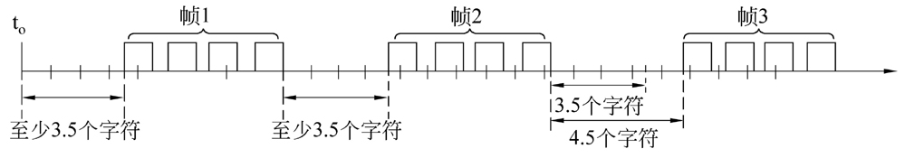
Modbus RTU帧格式：  
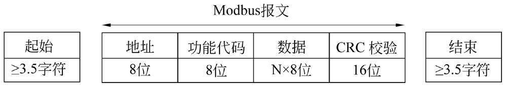  
协议规定当波特率等于或低于19200bps时，需要严格遵守时间间隔；而在波特率大于19200bps的情况下，时间间隔使用固定值。建议1.5个字符时间间隔为750μs，帧间时间间隔为1750μs。  
**地址域：**  
所谓地址域，指的是Modbus通信帧中的地址字段，其内容为从设备地址。Modbus消息帧的地址域包含2个字符（ASCII模式）或者1个字节（RTU模式）。  
Modbus寻址范围：
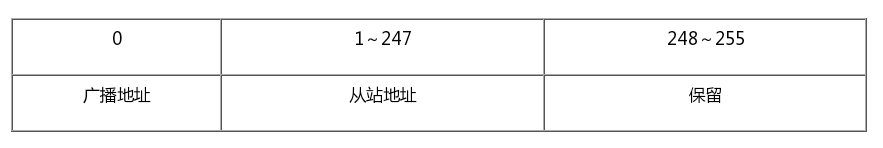  
**功能码域：**  
功能码在Modbus协议中用于表示消息帧的功能。常用的功能码有03、04、06、16等，  
03功能码的作用是读保持寄存器内容  
04功能码的作用是读输入寄存器内容  
06功能码的内容是预置单个保持寄存器  
16功能码的内容则是预置多个保持寄存器  
**数据域：**   
数据域与功能码紧密相关，存放功能码需要操作的具体数据。数据域以字节为单位，长度是可变的，对于有些功能码，数据域可以为空。  
## Modbus差错校验  
在Modbus串行通信中，根据传输模式（ASCII或RTU）的不同，差错校验域采用了不同的校验方法。  
**ASCII模式**  
在ASCII模式中，报文包含一个错误校验字段。该字段由两个字符组成，其值基于对全部报文内容执行的纵向冗余校验（Longitudinal Redundancy Check, LRC）计算的结果而来，计算对象不包括起始的冒号（:）和回车换行符号（CRLF）。  
**RTU模式**    
在RTU模式中，报文同样包含一个错误校验字段。与ASCII模式不同的是，该字段由16个比特位共两个字节组成。其值基于对全部报文内容执行的循环冗余校验（Cyclical Redundancy Check, CRC）计算的结果而来，计算对象包括校验域之前的所有字节。  
**LRC校验**  
计算LRC校验码的时机，是在对报文中每个原始字节进行ASCII码编码之前，对每个原始字节进行LRC校验的计算操作。  
生成LRC校验值的过程如下：  
（1）对消息帧中的全部字节相加（不包括起始“:”和结束符“CR-LF”），并把结果送入8位数据区，舍弃进位。  
（2）由0xFF（即全1）减去最终的数据值，产生1的补码（即二进制反码）。  
（3）加“1”产生二进制补码。  
以上产生的LRC值占用1个字节，但实际上在通过串行链路由ASCII模式传递消息帧的时候，LRC的结果（1个字节）被编码为2个字节的ASCII字符，并将其放置在ASCII模式报文帧的CR-LF字段之前。  
**CRC校验**  
在ModbusRTU传输模式下，通信报文（帧）包括一个基于循环冗余校验（CRC）方法的差错校验字段。  
Modbus协议中的RTU校验码（CRC）计算，运算规则（即CRC计算方法）如下：  
（1）预置一个值为0xFFFF的16位寄存器，此寄存器为CRC寄存器。  
（2）把第1个8位二进制数据（即通信消息帧的第1个字节）与16位的CRC寄存器的相异或，异或的结果仍存放于该CRC寄存器中。  
（3）把CRC寄存器的内容右移一位，用0填补最高位，并检测移出位是0还是1。  
（4）如果移出位为零，则重复步骤（3）（再次右移一位）；如果移出位为1，则CRC寄存器与0xA001进行异或。  
（5）重复步骤（3）和（4），直到右移8次，这样整个8位数据全部进行了处理。  
（6）重复步骤（2）～（5），进行通信消息帧下一个字节的处理。  
（7）将该通信消息帧所有字节按上述步骤计算完成后，得到的16位CRC寄存器的高、低字节进行交换。即发送时首先添加低位字节，然后添加高位字节。  
（8）最后得到的CRC寄存器内容即为CRC校验码。  
需要强调的一点是，在CRC计算时只有串行链路上每个字符中的8个数据位参与计算，而其他比如起始位及停止位，如有奇偶校验位也包括奇偶校验位，都不参与CRC计算。  
## 字节序和大小端  
所谓的大端模式，是指数据的低位保存在内存的高地址中，数据的高位保存在内存的低地址中。  
所谓的小端模式，是指数据的低位保存在内存的低地址中，而数据的高位保存在内存的高地址中。  
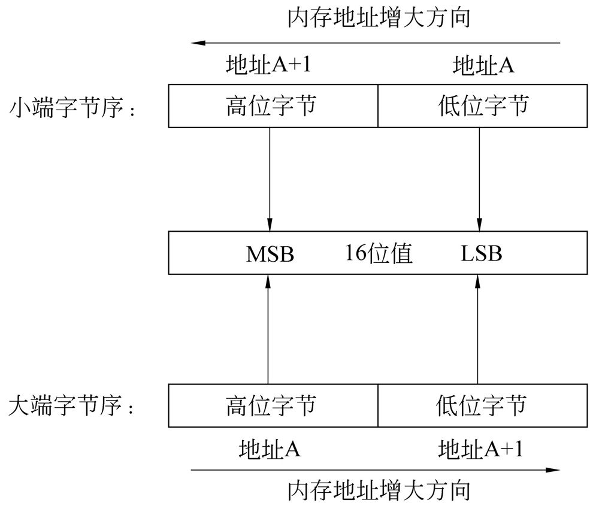  
Little-Endian模式CPU内存中的存放方式（假设从地址0x4000开始存放）为：  
  
Big-Endian模式CPU内存中的存放方式则为：  
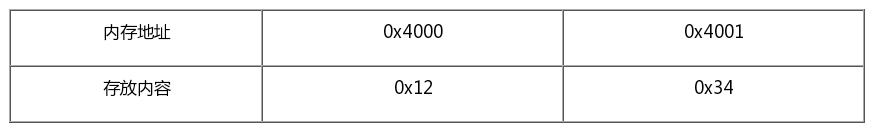   
注：实际上，Modbus协议中规定一个寄存器占用16位即2个字节长度，因此，开发之前有必要搞清楚系统的大小端模式和字节序。  
## Modbus TCP消息帧格式  
PDU和ADU关系：  
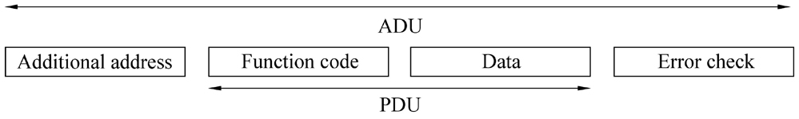  
在TCP/IP网络上的Modbus协议需要引入一个称为MBAP（Modbus Application Header）报文头的字段,Modbus TCP/IP ADU与PDU的关系:  
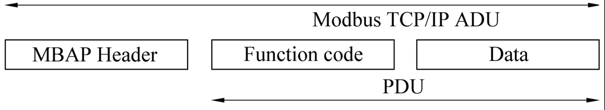  
Modbus TCP/IP与Modbus串行链路之间，报文数据构造的区别和联系  
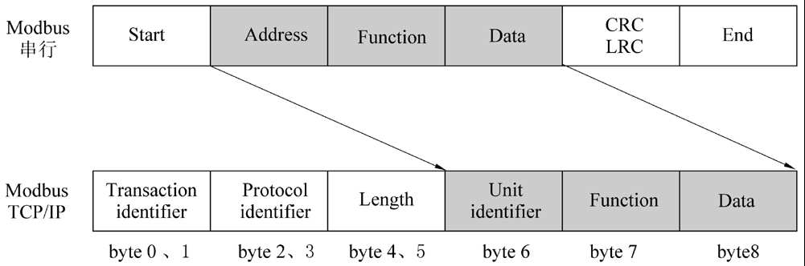  
MBAP报头说明:  
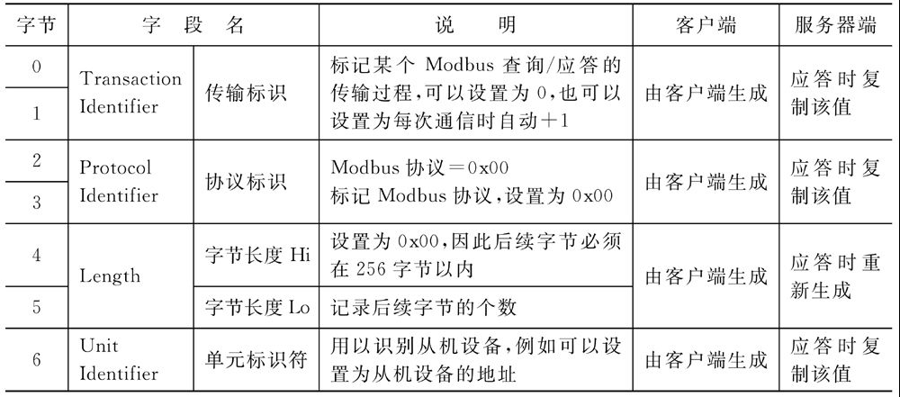  
## 查询与响应报文例
对于Modbus TCP消息帧格式，下面举例说明各部分的含义。  
•　查询报文：00 00 00 00 00 06 09 03 00 04 00 01  
0x06：后续还有6个字节  
0x09：单元标识符为9  
0x03：功能码3，即读保持寄存器的值  
0x00 0x04:Modbus起始地址4（即40005）  
0x00 0x01：读取寄存器个数为1  
•　响应报文：00 00 00 00 00 05 09 03 02 00 05  
0x05：表示后续还有5个字节  
0x09：同查询报文，单元标识符   
0x03：功能码，同查询报文
0x02：返回数据字节数  
0x00 0x05：寄存器的值  
可见，在Modbus TCP模式下，差错校验字段已不复存在。但在某些特殊场合，例如串行Modbus协议转Modbus TCP的情况下，串行协议数据可以完整地装载到Modbus TCP协议的数据字段，这时CRC或者LRC差错校验字段仍然存在。例如，Modbus RTU Over TCP/IP或Modbus ASCII Over TCP/IP等。  
## 功能码概要
Modbus功能码占用一个字节，取值范围是1～127。之所以127以上不能使用，是因为Modbus规定当出现异常时，功能码+0x80（十进制128）代表异常状态，因此129（1+128）～255（127+128）的取值代表异常码。  
Modbus标准协议中规定了有3类Modbus功能码，分别是：  
1．公共功能码  
（1）被明确定义的功能码；  
（2）保证唯一性；  
（3）由Modbus协会确认，并提供公开的文档；  
（4）可进行一致性测试；  
（5）包括协议定义的功能码和保留将来使用的功能码。  
2．用户自定义功能码  
（1）有两个用户自定义功能码区域，分别是65～72和100～110；  
（2）用户自定义，不保证唯一性。  
Modbus部分功能码  
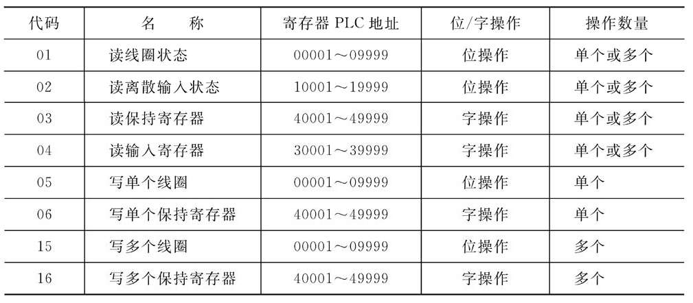  
功能码可分为位操作和字操作两类。位操作的最小单位为一位（bit），字操作的最小单位为两个字节。  
位操作指令：读线圈状态功能码01，读（离散）输入状态功能码02，写单个线圈功能码06和写多个线圈功能码15。  
字操作指令：读保持寄存器功能码03，读输入寄存器功能码04，写单个保持寄存器功能码06，写多个保持寄存器功能码16。  
**01（0x01）读取线圈/离散量输出状态**  
该功能码用于读取从设备的线圈或离散量输出的状态，即各DO（Discrete Output，离散输出）的ON/OFF状态。  
**查询** 帧的消息里，定义了从设备地址为3，并读取从设备的Modbus地址00019～00055（线圈地址00020～00056）共计37个状态值。起始线圈地址为0x13（即十进制00019），因为线圈地址从0开始计数。  
功能码01查询报文例:  
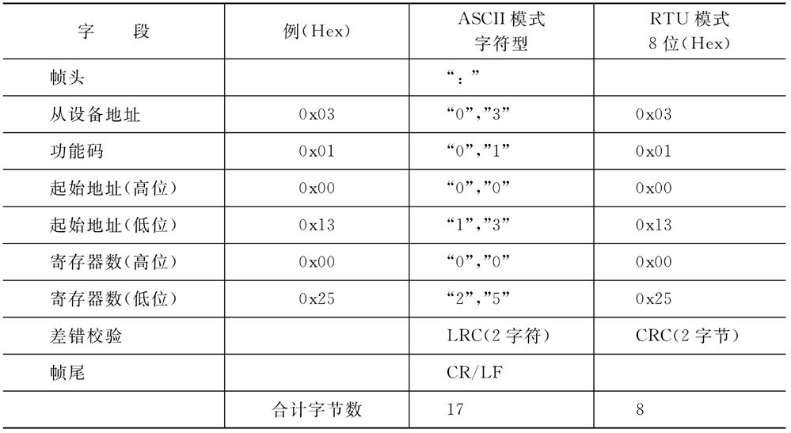  
Modbus协议规定，起始地址由2个字节构成，取值范围为0x0000～0xFFFF；线圈数量由2个字节构成，取值范围为0x0001～0x07D0（即十进制1～2000）。  
**响应** 报文的数据字段中，每一个线圈占用1个位（bit），状态被表示为1=ON和0=OFF两种类型。第1个数据字节的LSB（最低有效位）标识查询报文中的起始地址线圈的状态值，其他线圈依次类推，一直到这个字节的MSB（最高有效位）为止，并在后续字节中按照同样的方式（由低到高）排列。  
功能码01响应报文例:  
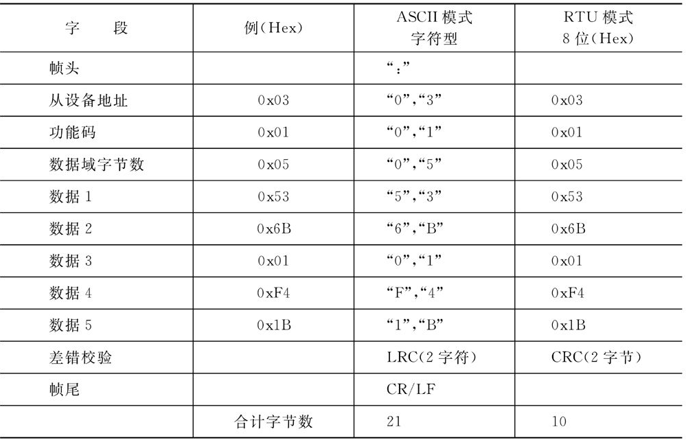  
**02（0x02）读取离散量输入值** 
功能码02查询报文例:
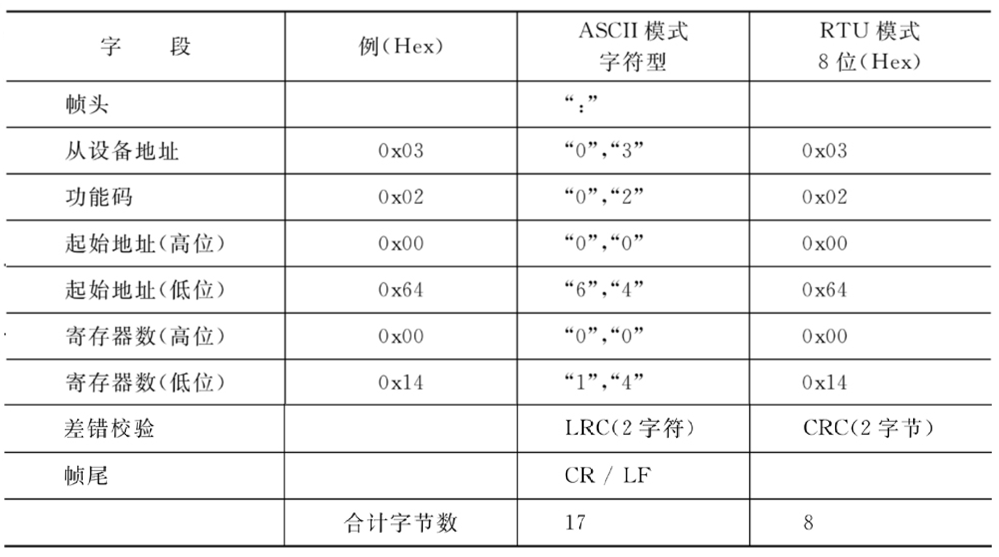  

