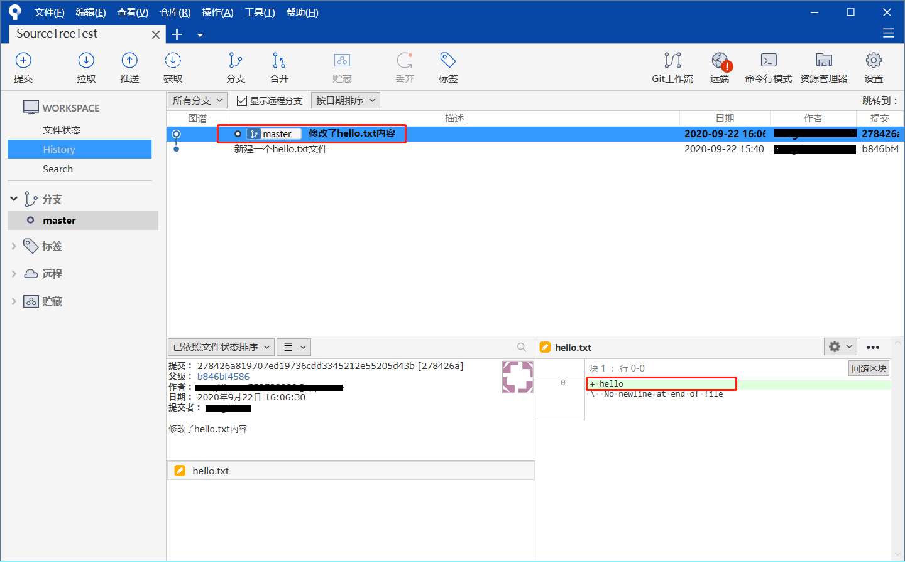
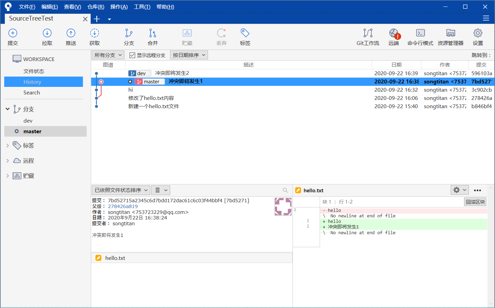
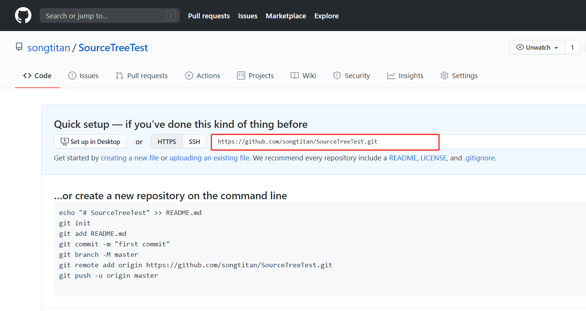

# 1.SourceTree下载

下载地址：https://www.sourcetreeapp.com/  
# 2.SourceTree初步使用
(1) 在安装好SourceTree之后，在任意一个地方新建一个文件夹（本文以桌面的SourceTreeTest为例）。打开SourceTreeTest之后，点击“Create”，选中之前创建好的文件夹，再点击“创建”，即执行init命令。  
  
(2) 打开文件夹之后，会出现一个.git的隐藏文件夹，这个需要勾选“查看隐藏项目”才可看见。  
  
  
(3) 在SourceTreeTest文件夹中新建一个hello.txt，在SourceTree中会自动刷新如下图。点击“暂存”，即执行add操作，将文件加入暂存区。
  
  
(4) 写好注释并提交，即将hello.txt文件保存到我们新建的sourcetreeTest仓库中  
  
(5) 修改hello.txt内容：添加"hello",SourceTree中会自动刷新如下图：左上角“提交”处会出现一个角标1，未暂存文件hello.txt的图标改变为“已修改”（注意和之前的比对）。同样写好注释并提交  
  
(6) 点击左侧History，可以看到，我们进行的两步操作都被记录下来。在右下角部分还可以看到我们添加的内容"hello"    
  
(7) 新建分支dev并切换到该分支（双击或右键检出）
  
(8) 新建hi.txt文件，并添加内容"hi"，与前几步一样，暂存，写注释，提交。
结果是在dev分区中一共有两个文件，而在master分区中只有一个，因为hi.txt是在dev分区中创建的，所以master分区不可见。  
(9) 在master分区中修改hello.txt文件：添加内容“冲突即将发生1”，接着暂存，提交。切换到dev分区，会发现hello.txt文件内容并未修改。修改hello.txt，添加内容如下：“冲突即将发生2”，将修改后的文件添加到暂存区并提交。  
  
(10) 合并dev分区到master分区：  
  
因为我们在两个分区中都修改了hello.txt，所以合并时会弹窗提示。  
  
(11) 接下来，我们解决冲突,打开hello.txt文件如下:  
  
删除自动生成的那部分内容  
  
保存，在SourceTree的暂存文件中，右键hello.txt，标记冲突已解决。  
  
(12) 写好注释并提交，即可发现，分支已合并，打开sourcetreeTest文件夹，所有文件（hello.txt和hi.txt）都整合到了master分支下，并且内容也整合到了一起。（dev分区可删除，可保留）  
   
(13) 丢弃操作：当文件修改后不想把修改的内容提交，还想还原到未修改之前的状态。此时可以使用“丢弃”功能,在hi.txt文件中添加内容：123abc，然后丢弃更改，会发现刚刚修改的内容已经没有了。
   
# Clone克隆远程仓库到本地
(1) 复制github仓库里面项目的http地址  
   
(2) 在SourceTree中新建一个窗口，选择Clone，填写源路径/URL,这里使用的是http地址(刚刚复制的http地址)，填写好之后点击克隆即可
  
# 将本地仓库推送到Github上
(1) 首先，在github上新建一个仓库，选择public，不勾选Initialize this repository with a README  
  
  
创建之后，github会给出一个这个仓库的链接，有https和ssh两种方式，这里使用https，然后复制该链接。  
  
(2) 接着，以之前(SourceTree初步使用)创建的的本地仓库为例，添加一个远程仓库路径如下第二图，选择默认远端并将刚才在github上新建仓库的链接粘贴过来
   
   
(3) 点击推送，将本地仓库推送到github上  
  

