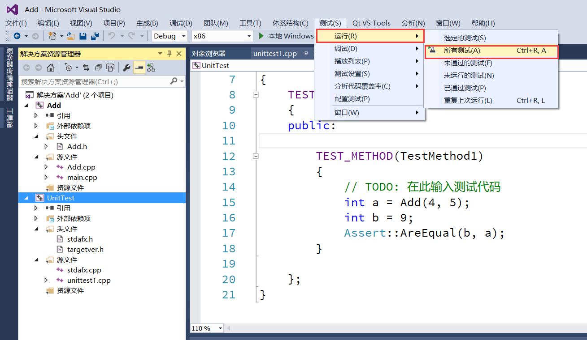

# Visual Studio 2015单元测试     
## 新建项目 
1.打开VisualStudio2015->文件->新建->项目->Visual C++->Win32 控制台应用程序(Add项目)，在项目里面添加一个int Add(int a,int b);(用作测试)   
  
   
2.右击解决方案->添加->新建项目->Visual C++->测试->本机单元测试项目(UnitTest)   
  
    
## 进行单元测试   
1.添加引用   
   
   
2.包含头文件   
   
3.附加库目录   
    
4.附加依赖项   
   
5.输入测试代码   
   
Assert::AreEqual(b,a)的作用是验证a和b是否相等。    
6.测试生成   
    
7.运行测试   
   
8.查看测试结果   
    
## 调试   
1.标记断点->测试->调试->所有测试    
    

