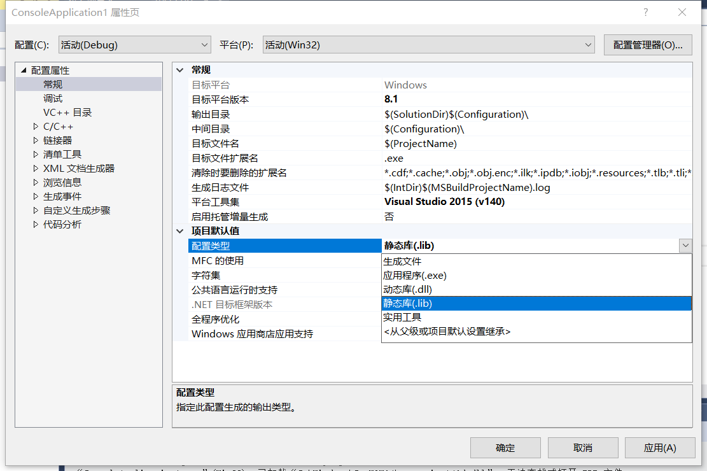
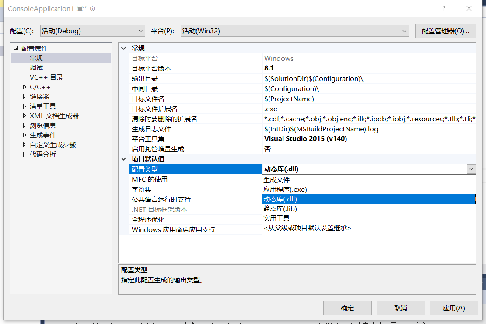
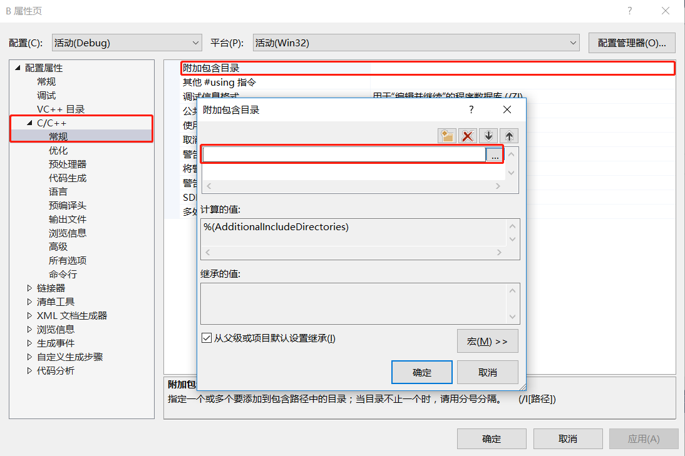
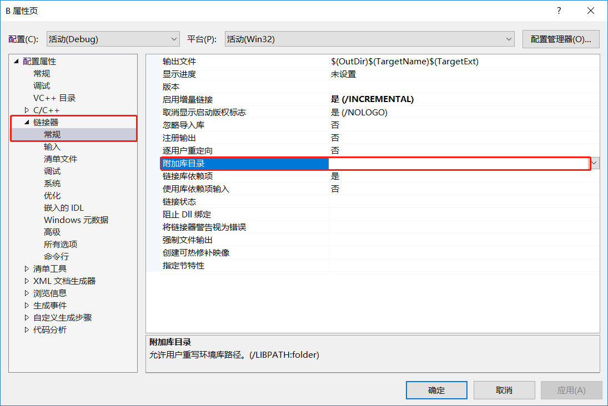
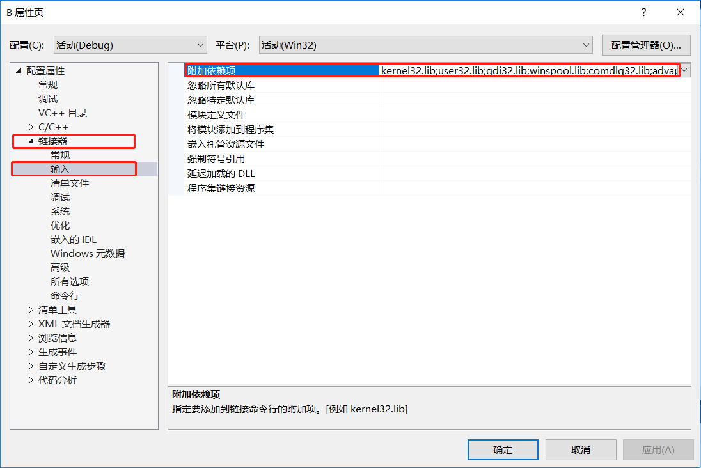

# 静态库生成
1.右击项目->属性->常规->配置类型->静态库(.lib)  
  
2.对项目进行编译即可
# 动态库生成  
1.右击项目->属性->常规->配置类型->动态库(.dll)  
  
2.在.h文件里面配置参数，之后编译即可  
```
#ifdefine MYDLL
#define MYDLL_API extern "C" __declspec(dllexport)
#else
#define MYDLL_API extern "C" __declspec(dllimport)
#endif //MYDLL

Class MYDLL A       //Class和类名中间添加MYDLL
{
public:
    int Sa;
    int Sum(int a,int b);
}

MYDLL int Add(int a,int b);     //函数最前面添加MYDLL
```
# 隐式调用
1.静态库隐式调用  
(1) 右击项目->属性->C/C++->常规->附加包含目录(添加库里面需要的.h头文件)
  
(2) 右击项目->属性->链接器->常规->附加库目录(添加库的所在目录)  
  
(3) 右击项目->属性->链接器->输入->附加依赖项(添加需要的库的文件名.lib)
  
2.动态库隐式调用和静态库一样，dll文件优先和.exe放在同一目录下  
# 动态库的显示调用  
```
#include <iostream>
#include <Windows.h>
using namespace std;
typedef int(*fun)(const int &a, const int &b);
int main()
{
	HINSTANCE mydll = LoadLibrary("..//Debug//C.dll");
	if (mydll != NULL)
	{
		fun Mul = (fun)GetProcAddress(mydll, "Mul");
        if(Mul!=NULL)
        {
            cout << "调用成功！"<< endl;
        }
        else
        {
            cout << "调用失败！"<< endl;
        }
	}
	FreeLibrary(mydll);
    return 0;
}
```

